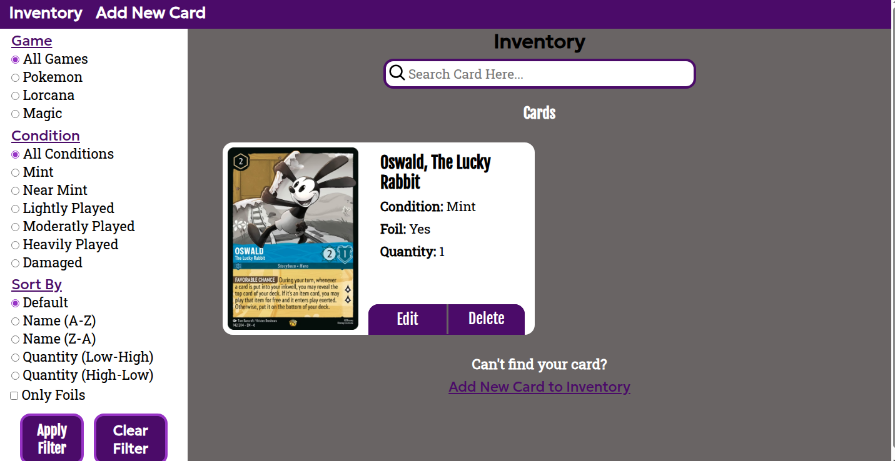
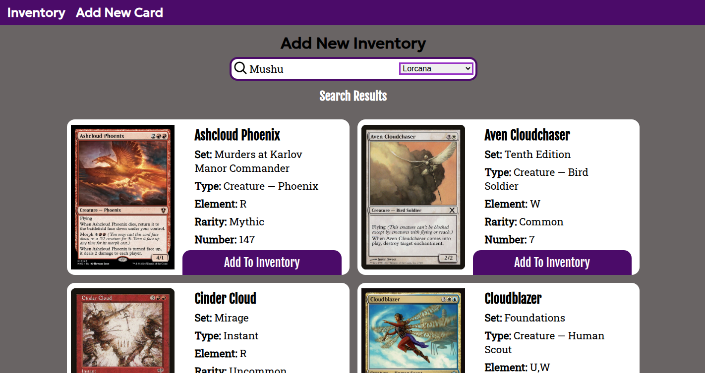

# Card Shop Inventory

A full-stack inventory management application for trading card shops. Search cards from multiple trading card APIs and add them to the shop's inventory.

## Features

- **Card Search:** Search multiple card APIs and view returned card data before adding to inventory.

- **Inventory Management:** Add, edit and delete cards from the database

- **Filtering:** On inventory page, use filters to sort current cards by game, condition and card attributes.

- **Accessibility:** Built with semantic HTML, accessible forms, and keyboard-friendly interaction.

- **Responsive Design:** Designed for use across mobile and desktop devices.

## Screenshots

### Inventory Page



### Add Card Page



## Technologies Used

### Frontend

- HTML
- CSS
- JavaScript
- EJS Templates

### Backend

- Node.js
- Express
- PostgreSQL

### APIs

- **Lorcast:** https://lorcast.com/docs/api
- **Pokemon Tcg API:** https://docs.pokemontcg.io/
- **Scryfall** = https://scryfall.com/docs/api

## Prerequisites

- PostgreSQL
- npm

## Installation

1. Clone the repository

```bash
git clone https://github.com/Salypse/card-inventory.git
```

2. Install dependencies

```bash
npm install
```

3. Create a .env file

```bash
touch .env
```

4. Create environment variables

```bash
PORT=desired_port_number
CONNECTION_STRING=database_connection_string
ADMIN_PASSWORD=password
```

**PORT** and **ADMIN_PASSWORD** are optional. **CONNECTION_STRING** should link to the PostgreSQL database you want to use for your application.

5. Create sample data inside the database

```bash
node db/populatedb.js
```

6. Run the application

```bash
node app.js
```

## Usage

### Adding a card to inventory

1. On the Add Inventory page, use the search bar to enter the name of the card you are looking for and select a game to search from.

2. After a successful search, either a list of cards will be displayed or a message saying none have been found.

3. Select the desired cards and add to inventory button. You will be directed to a form where you can enter the card's condition, quantity and foil status. Once the form is completed, submit it and your new card is added to inventory.

### Managing inventory

#### Deleting a card

1. On the Inventory page, click any cards delete button which opens the password check form. Enter the correct password and the selected card will be deleted.

#### Editing a card

1. On the Inventory page, click any cards edit button, which will direct you to the edit page where you can change the card's condition, quantity and foil status. Once changes are made, submit it which opens the password check form. Enter the correct password and the selected card will be updated with new changes.
